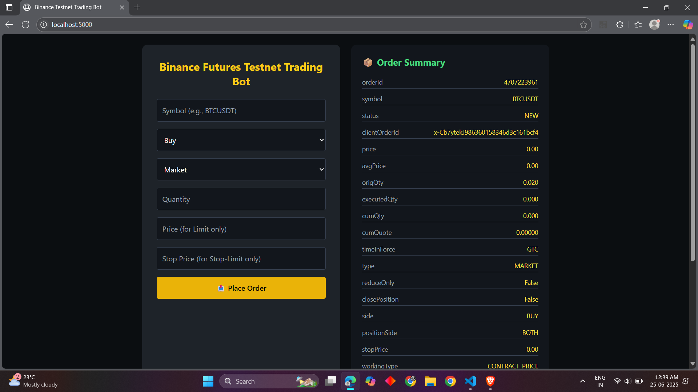
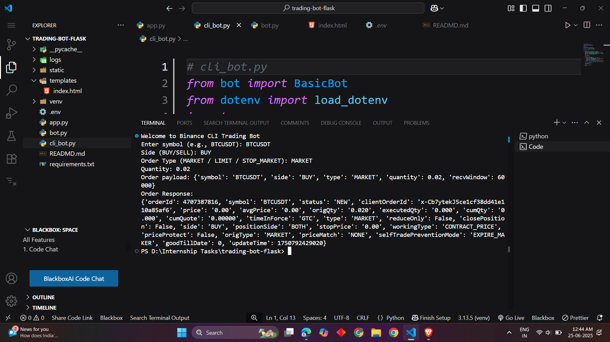

# 🔁 Binance Futures Trading Bot (Testnet)

A sleek and simplified Python-based trading bot built using **Flask** and the `python-binance` library. It lets you place various orders (Market, Limit, Stop-Market) directly on the **Binance USDT-M Futures Testnet** through a clean and responsive web interface. Perfect for beginners in algo-trading and crypto automation.

---

## 🚀 Features

✅ Place **Market**, **Limit**, and **Stop-Market (Stop-Limit)** orders  
✅ Supports both **Buy** and **Sell** order types  
✅ Uses **Flask** for a lightweight web-based UI  
✅ All orders routed via **Binance Futures Testnet API**  
✅ Real-time structured **order summary card**  
✅ API **logging** and robust **error handling**  
✅ Bonus: Supports **Stop-Limit order** + **custom dark theme UI**

---

## 📸 Screenshots

> UI Preview of the Web Interface, Order Summary and Terminal Logs

| UI Page | Order Summary | CLI Execution | Logs |
|--------|----------------|---------------|------|
|  |  |  |  |

---

## 🛠 Tech Stack


---

## 🧪 How to Run This Project

### 1. Clone the Repository

```bash
git clone https://github.com/am-vyavhare/trading-bot-flask.git
cd trading-bot-flask


---

## 🛠 Tech Stack


---

## 🧪 How to Run This Project

### 1. Clone the Repository
```bash
git clone https://github.com/am-vyavhare/trading-bot-flask.git
cd trading-bot-flask
```

### 2. Setup Virtual Environment & Install Dependencies
```bash
python -m venv venv
venv\Scripts\activate  # On Windows
pip install -r requirements.txt
```

### 3. Configure Your API Keys
Create a `.env` file in the project root:
```ini
API_KEY=your_binance_testnet_key
API_SECRET=your_binance_testnet_secret
```
🔐 Use your [Binance Futures Testnet](https://testnet.binancefuture.com/) credentials.

### 4. Run the Flask App
```bash
python app.py
```

App will be available at: [http://127.0.0.1:5000](http://127.0.0.1:5000)

---

## 📋 Sample Order Inputs

| Symbol    | Side | Type       | Quantity | Price (for Limit) | Stop Price (for Stop) |
|-----------|------|------------|----------|-------------------|------------------------|
| BTCUSDT   | BUY  | MARKET     | 0.01     | -                 | -                      |
| BTCUSDT   | SELL | LIMIT      | 0.02     | 62000             | -                      |
| ETHUSDT   | BUY  | STOP_MARKET| 0.05     | -                 | 3800                   |

---

## 📂 Folder Structure
```
trading-bot-flask/
├── app.py              # Main Flask application
├── bot.py              # Core trading bot logic
├── templates/
│   └── index.html      # Web form UI
├── logs/
│   └── bot.log         # Logs requests/errors
├── .env                # API keys (not pushed)
├── requirements.txt    # All dependencies
└── README.md
```

---


## 🧑‍💻 Author
[Aniket Vyavhare](https://github.com/am-vyavhare) 

---

## 📜 License
This project is intended for educational/demo purposes on **Binance Testnet** only. Do **not** use with real funds.
